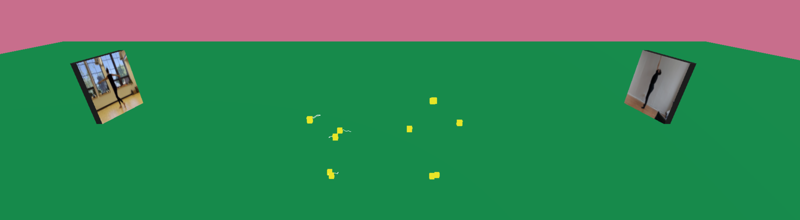

# olos-template

## About

This is a project by [Lisa Jamhoury](https://lisajamhoury.com/) and [Aarón Montoya-Moraga](https://montoyamoraga.io/), funded in 2022 by the Next Web grant from NEW INC and Meta Open Arts.



## Explanation

This project is a template for creating an immersive three.js website that features live video feeds, pose detection, and interactive sound from two people.

On startup, it displays and livestreams the webcam feed and 3D pose data of both players. There is an option to turn on background removal (using body segmentation) as well. Using keypresses, you can also add interactive audio that is influenced by the 3D pose data.

By default this project runs on recorded videos and recorded data so you can see what it looks like. Please note that the background removal doesn't work when using recorded data. See the section on Creating a Peer Connection for instructions on how to work with live webcam and pose detection.

## Why Use This

We created this template from our project Olos, a telematic web performance between Chile and the US. For our project, we built everything from scratch. We thought it might be helpful to a wider community, to open source some of our building blocks to get started in building telematic web performance.

This template includes the code to:

- create a peer-to-peer connection with one other person
- run pose detection and body segmentation on both people
- stream the video and pose
- create interactive audio
- integrate all of this into a basic three.js environment.

It does not include:

- a signaling server (more on that below)
- creative three.js or audio development.

## Technical Details

- Pose detection is done with [TensorFlow.js Blazepose](https://blog.tensorflow.org/2021/05/high-fidelity-pose-tracking-with-mediapipe-blazepose-and-tfjs.html).
- Peer to peer connection is done with [simple-peer-wrapper](https://github.com/lisajamhoury/simple-peer-wrapper) and [simple-peer-server](https://github.com/lisajamhoury/simple-peer-server).
- Sound is done with [Tone.js](https://tonejs.github.io/).
- 3D environment is done with [three.js](https://threejs.org/).

## Installation

Clone this repository and then install the dependencies with this command.

```bash
npm install
```

If it doesn't work, try this alternative command.

```bash
npm install --legacy-peer-deps
```

## Running

For building and deploying the base project, run this command.

```bash
npm start

# runs the project at https://localhost:1234
```

## Creating a Peer Connection

This project uses [simple-peer-wrapper](https://github.com/lisajamhoury/simple-peer-wrapper) to create a peer connection via [simple-peer](https://github.com/feross/simple-peer).

It **does not** include a signaling server, which is needed to create the peer connections! In order to run the project live, you will need to create your own signaling server using [simple-peer-server](https://github.com/lisajamhoury/simple-peer-server).

Once you have created a signaling server, you create live peer connections between two browsers/users as follows:

```javascript
// in constants.js update the following variables as follows

const LIVE = true;

const PEERSERVERURL = 'http://localhost:8081'; // add your url here'
```

**Pro tip!** You can create a public server from your local host using [ngrok](https://ngrok.com/). Once you've downloaded the software, you just run

```bash
ngrok http 8081 # your port here
```

Learn more in the [ngrok documentation](https://ngrok.com/docs/secure-tunnels#http-tunnels-local-https)

## Repository Structure

The source code lives on the [src/](./src/) folder, which includes the following files and folders:

- [src/index.html](./src/index.html): main HTML file.
- [src/sketch.js](./src/sketch.js): main JavaScript file that imports the modules and creates instances of all the needed components.
- [src/media/](./src/media/): multimedia files for running the project in non-live mode, including video files and JSON files.
- [src/modules](./src/modules/): JavaScript files with modules used for building the project, including:
  - [src/modules/audio/](./src/modules/audio/): JavaScript files built with Tone.js. It includes a base class for building instruments (percussion, melody synth, pad synth), a notes generator for building melodies and chords, a parameters file for controlling the instruments, and a mixer for instancing the instruments.
  - [src/modules/core](./src/modules/core): JavaScript files for the core functionalities of the project, peer connection and pose detection, and an utilities file.
  - [src/modules/player](./src/modules/player): JavaScript files for handling the webcam feeds.
  - [src/modules/scene/](./src/modules/scene/): JavaScript files built with three.js for the graphics.
  - [src/modules/constants.js](./src/modules/constants.js): JavaScript file with constants for development and live performance, and setup of the audio and visuals.

## Known Issues

The demo video and pose data timing are off! Sorry about that. We're working on a fix for it, but for now, it's the best we can do.

## Credits

- Created by Lisa Jamhoury and Aarón Montoya-Moraga
- Demo videos feature Hanna Satterlee and Soledad Rojas
- Scene / Three.js development Front End Development based on work by Aidan Nelson
